# JB Academic Publication Portal 

> **⚠️ Note:** This project is under active development. Some requirements, features, and implementation details may evolve as development progresses. Refer to the latest version of this document for the most current information.

[]()
[](https://nextjs.org/)
[](https://spring.io/projects/spring-boot)
[](https://fastapi.tiangolo.com/)
[](https://www.postgresql.org/)
[](https://min.io/)

---

## Table of Contents

- [Overview](#overview)
- [Technology Stack](#technology-stack)
- [System Roles](#system-roles)
- [Core System Modules](#core-system-modules)
  - [1. User Management and Authentication](#1-user-management-and-authentication)
  - [2. Submission Management](#2-submission-management)
  - [3. Review Workflow](#3-review-workflow)
  - [4. Publication and Repository](#4-publication-and-repository)
  - [5. Search and Discovery](#5-search-and-discovery)
  - [6. AI-Based Document Processing](#6-ai-based-document-processing)
- [System Architecture](#system-architecture)
- [Entity Relationship Diagram](#entity-relationship-diagram)
- [Deployment Architecture](#deployment-architecture)
- [Development Approach](#development-approach)

---

## Overview

The **Academic Research and Project Submission Portal** is a web-based platform designed to manage the submission, review, and publication of academic work within a college environment.

The system supports multiple categories of academic output including:

- Research Papers
- Major Project Reports
- Mini Project Reports
- Internship Reports

The platform provides a structured workflow where:

1. **Students** submit academic work.
2. **Faculty members** review the submissions.
3. **Administrators or Heads of Department** make final decisions.
4. Approved submissions are **published** in a public academic repository.

The system also includes a dedicated **AI document processing service** responsible for PDF validation, text extraction, and semantic indexing to improve document discovery and analysis.

---

## Technology Stack

| Layer | Technology |
|-------|------------|
| Frontend | Next.js with TypeScript |
| Backend | Spring Boot (Java + Kotlin) |
| AI Service | Python FastAPI with Retrieval-Augmented Generation (RAG) |
| Database | PostgreSQL with pgvector extension |
| File Storage | MinIO (S3-compatible object storage) |

---

## System Roles

The platform defines four primary roles.

| Role | Description |
|------|-------------|
| **Guest** | Browse and access published academic content without authentication |
| **Student** | Submit academic work, track progress, view feedback, and submit revisions |
| **Faculty Reviewer** | Evaluate assigned submissions, provide feedback, and recommend decisions |
| **Admin / HOD** | Manage users, assign reviewers, make final decisions, and publish approved work |

### Use Case Diagram

```mermaid
graph TB
    subgraph "Guest Actions"
        Browse["Browse Publications"]
        Search["Search Publications"]
        View["View Paper Details"]
        Download["Download Documents"]
    end

    subgraph "Student Actions"
        Submit["Submit Academic Work"]
        Upload["Upload Documents"]
        Track["Track Submission Status"]
        Feedback["View Reviewer Feedback"]
        Revise["Submit Revisions"]
    end

    subgraph "Reviewer Actions"
        Review["Evaluate Submissions"]
        Score["Score Submission"]
        Recommend["Recommend Decision"]
    end

    subgraph "Admin Actions"
        Users["Manage Users"]
        Assign["Assign Reviewers"]
        Decision["Make Final Decision"]
        Publish["Publish Approved Work"]
        BulkImport["Bulk Import Users"]
    end

    Guest["Guest"] --> Browse
    Guest --> Search
    Guest --> View
    Guest --> Download

    Student["Student"] --> Submit
    Student --> Upload
    Student --> Track
    Student --> Feedback
    Student --> Revise

    Reviewer["Faculty Reviewer"] --> Review
    Reviewer --> Score
    Reviewer --> Recommend

    Admin["Admin / HOD"] --> Users
    Admin --> Assign
    Admin --> Decision
    Admin --> Publish
    Admin --> BulkImport
```

---

## Core System Modules

---

### 1. User Management and Authentication

The platform provides a centralized authentication and user management system.

**Key capabilities include:**

- Institutional account creation using roll number and institutional email
- Secure authentication using Spring Security and JWT
- Role-based access control
- Password change requirement during first login
- Profile management for students and faculty
- Administrative user management
- Bulk import of student accounts using CSV

#### Class Diagram — User Management

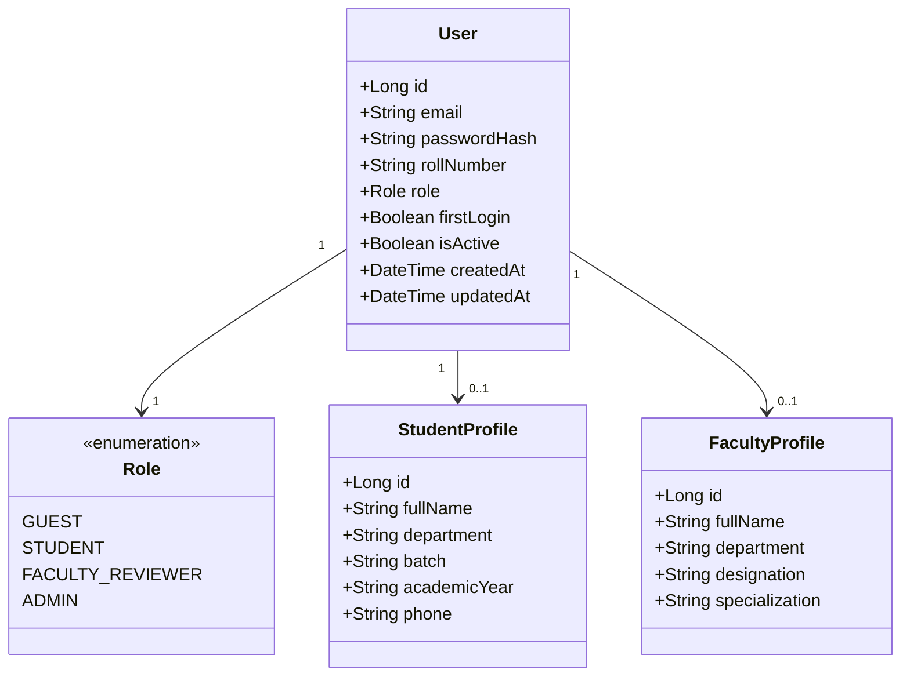

#### Sequence Diagram — Authentication Flow

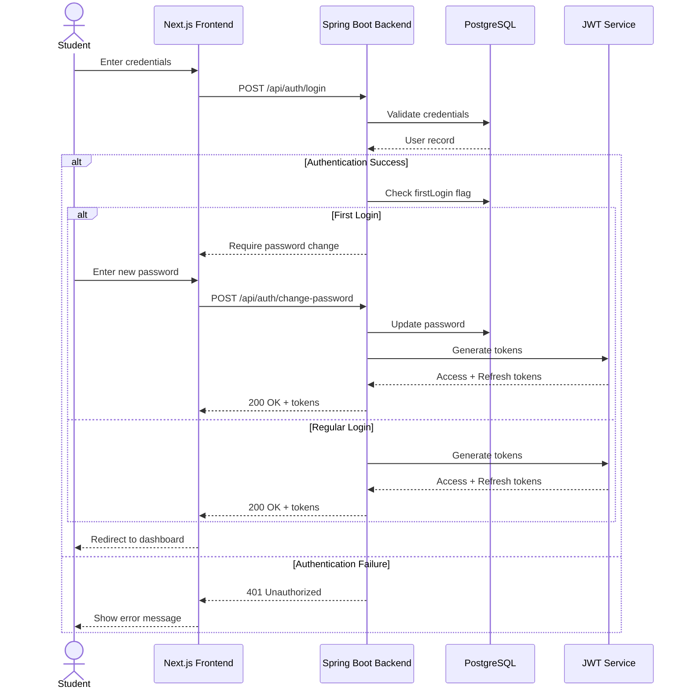

---

### 2. Submission Management

The submission module allows students to upload and manage academic work.

**Supported categories:**

| Category | Description |
|----------|-------------|
| Research Paper | Original research contributions |
| Major Project Report | Final year or capstone project reports |
| Mini Project Report | Smaller scope academic projects |
| Internship Report | Industry internship documentation |

**Each submission includes:**

- Title, abstract, and keywords
- Author information
- Department and academic year
- Uploaded PDF document
- Optional supplementary files (source code, GitHub links, images, videos)

**Additional features:**

- Draft saving before final submission
- Version tracking for revised submissions
- Unique submission identifiers for tracking

#### Submission Lifecycle

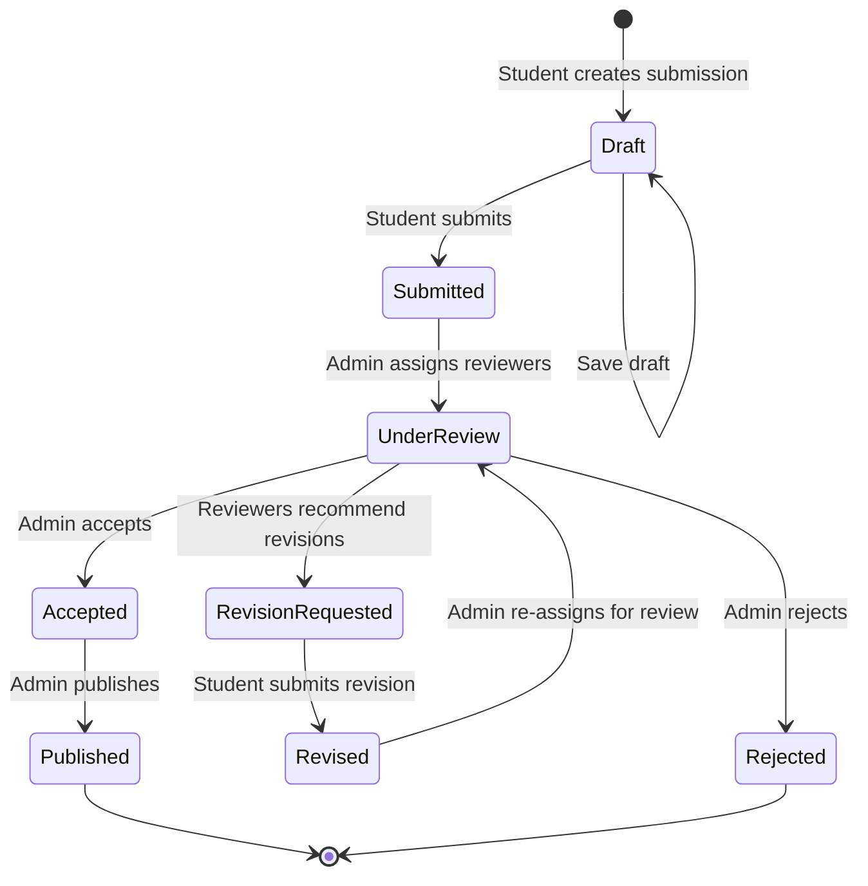

#### Class Diagram — Submission

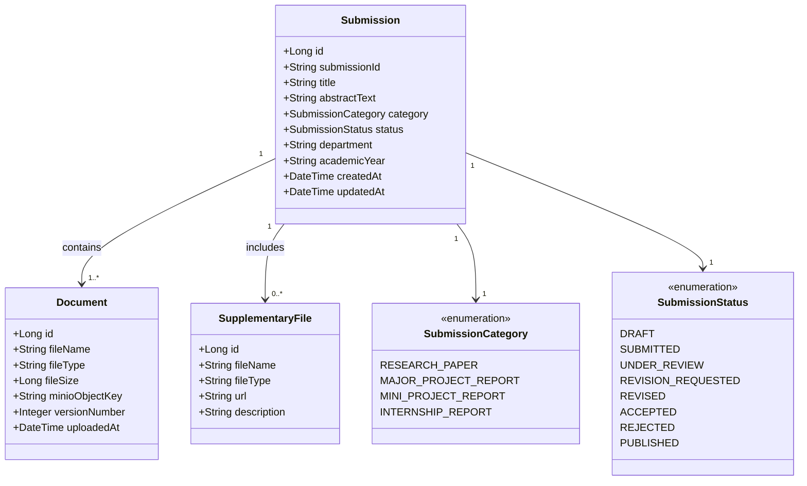

---

### 3. Review Workflow

The system implements a structured academic review workflow.

**Workflow steps:**

1. A student submits academic work.
2. The administrator assigns one or more faculty reviewers.
3. Reviewers evaluate the submission and provide feedback.
4. Reviewers recommend a decision.
5. The administrator makes the final decision.

**Possible decisions:**

| Decision | Description |
|----------|-------------|
| **Accept** | Submission is approved for publication |
| **Revision Required** | Student must address feedback and resubmit |
| **Reject** | Submission is not accepted |

#### Review Workflow Diagram

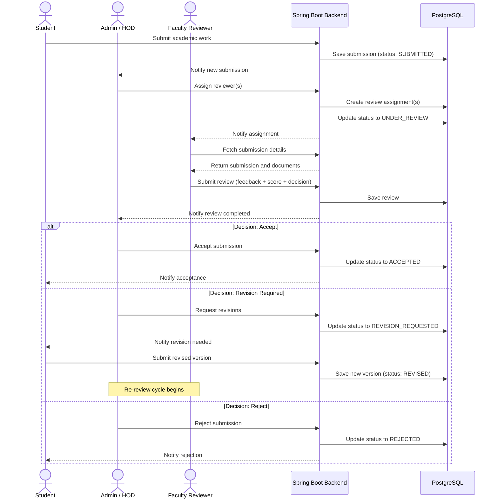

#### Class Diagram — Review System

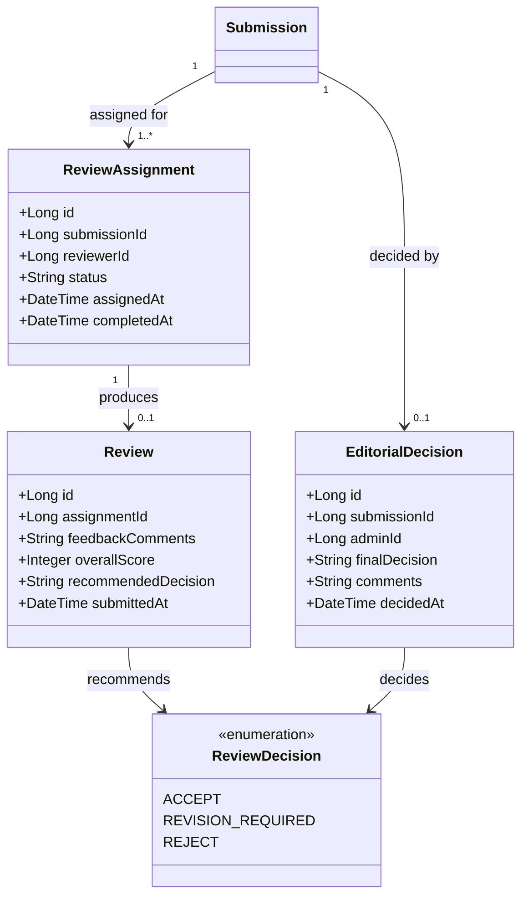

---

### 4. Publication and Repository

Submissions that are accepted are published in the institutional repository.

**Published records include:**

- Title and author information
- Abstract and keywords
- Downloadable PDF document
- Publication date
- View and download counts

**Content can be browsed by:**

- Department
- Academic year
- Submission category
- Author name

#### Class Diagram — Publication

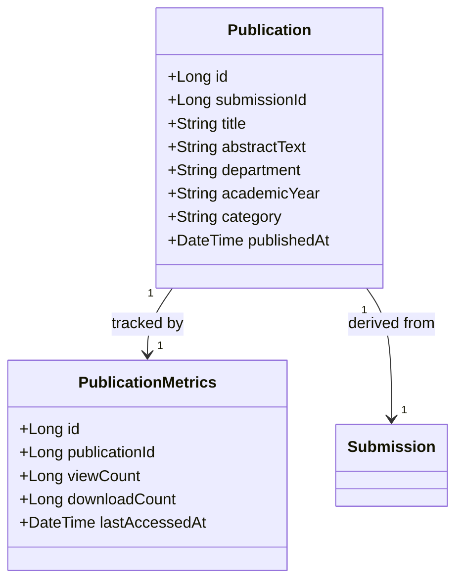

---

### 5. Search and Discovery

The portal includes a search system for discovering academic content.

**Capabilities include:**

- Full-text search across indexed documents
- Filtering by department, year, author, or category
- Keyword-based discovery
- Ranked search results by relevance

The search system uses **PostgreSQL full-text search** with semantic enhancement from the AI service.

#### Search Flow Diagram

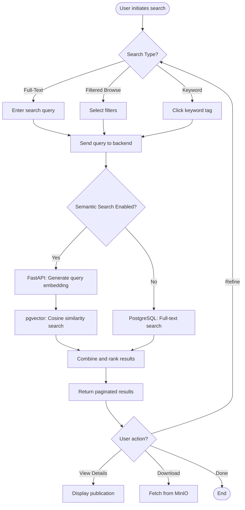

---

### 6. AI-Based Document Processing

Document analysis and semantic processing are handled by a dedicated **Python service built with FastAPI**.  
This service is responsible for validating uploaded documents, extracting meaningful information, and enabling AI-assisted discovery of academic content.

The AI service operates as an auxiliary component of the backend and is invoked whenever a new document is uploaded or when semantic search is requested.

**Key capabilities include:**

- Validation of uploaded PDF documents (format, integrity, and basic compliance checks)
- Extraction of textual content and structural metadata from documents
- Generation of semantic vector embeddings for document content
- Automatic generation of concise document summaries
- Support for semantic search and related document recommendations

The generated embeddings are stored in **PostgreSQL using the `pgvector` extension**, allowing efficient vector similarity searches across the document corpus.

---

#### AI Processing Pipeline

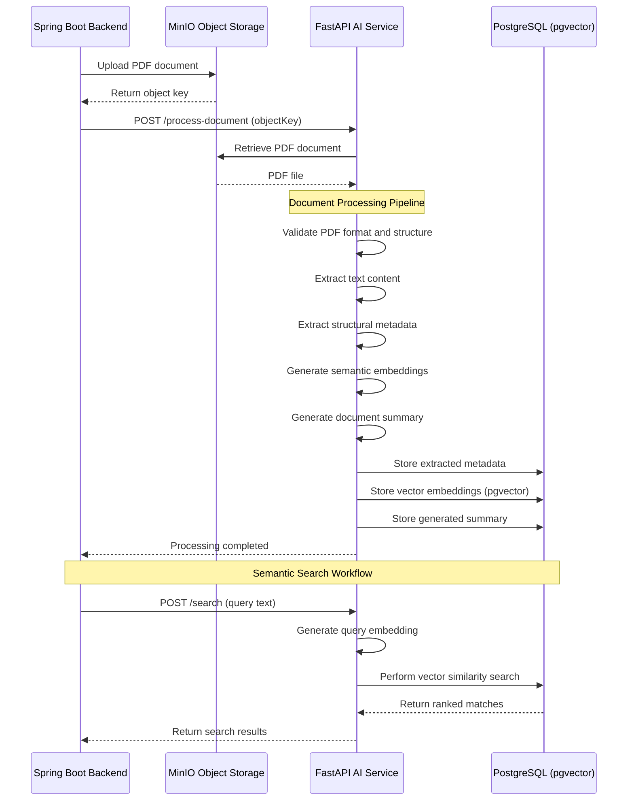

#### Class Diagram — AI Service

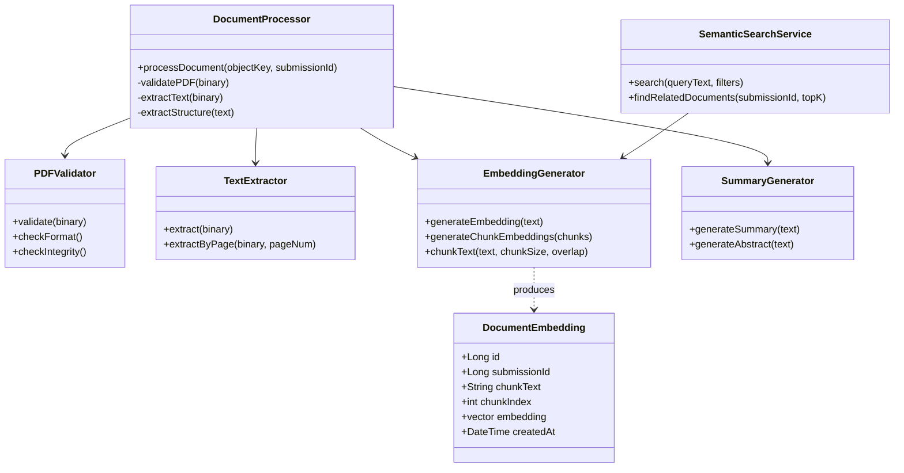

---

## System Architecture

The system follows a modular architecture consisting of a web frontend, a backend application, and a specialized document processing service.

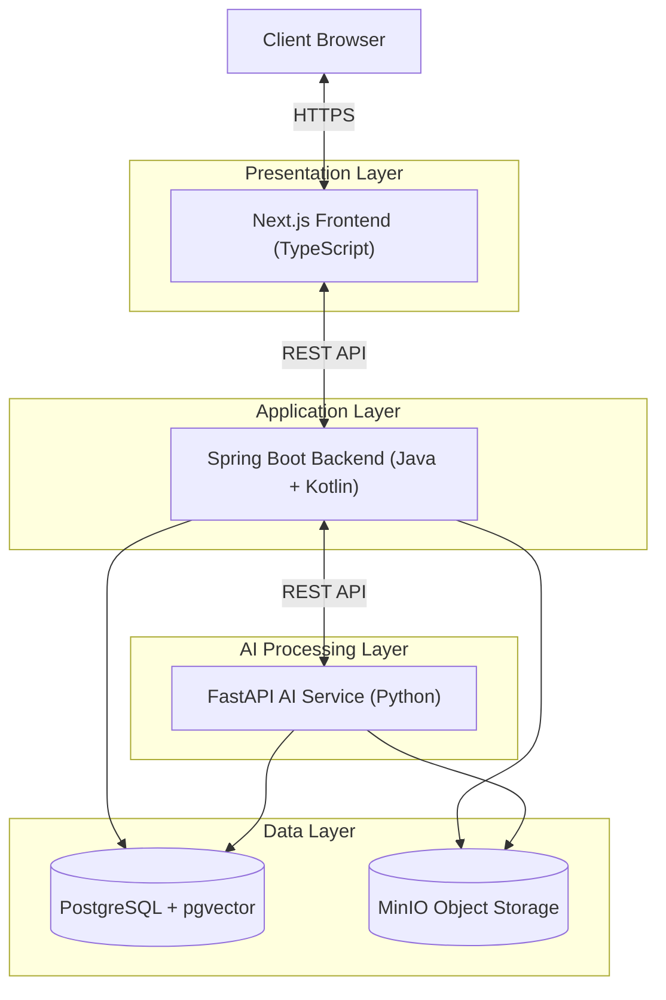

**Architecture Flow:**

```
Client Browser
      │
      ▼
Next.js Frontend (TypeScript)
      │
      ▼
Spring Boot Backend (Java + Kotlin)
      │
      ├── PostgreSQL (application data + pgvector)
      ├── MinIO (document storage)
      └── Python FastAPI Service (document processing + AI)
```

---

## Entity Relationship Diagram

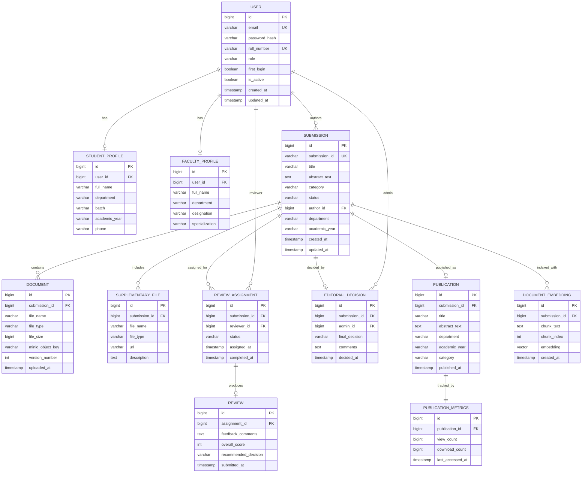

---

## Deployment Architecture

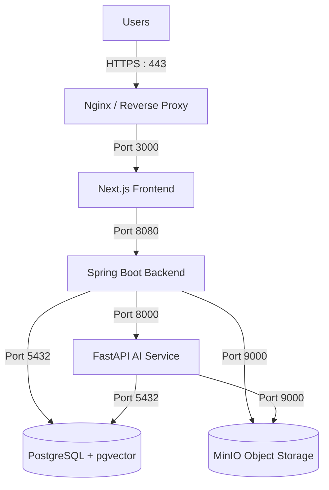

**Port Reference:**

| Service | Port | Protocol |
|---------|------|----------|
| Nginx (Reverse Proxy) | 443 | HTTPS |
| Next.js Frontend | 3000 | HTTP |
| Spring Boot Backend | 8080 | HTTP |
| FastAPI AI Service | 8000 | HTTP |
| PostgreSQL | 5432 | TCP |
| MinIO API | 9000 | HTTP |
| MinIO Console | 9001 | HTTP |

---

## Development Approach

Development will proceed incrementally with an emphasis on delivering a stable core platform first.

**Initial implementation focuses on:**

- Authentication and role management
- Submission workflow
- Review system
- Publication repository
- Search functionality
- AI-based document processing

**Future enhancements may include:**

- Advanced analytics and reporting dashboards
- Plagiarism detection
- Citation analysis
- Integration with external academic systems (ORCID, CrossRef)
- Email notification system
- Mobile-responsive progressive web app

---
