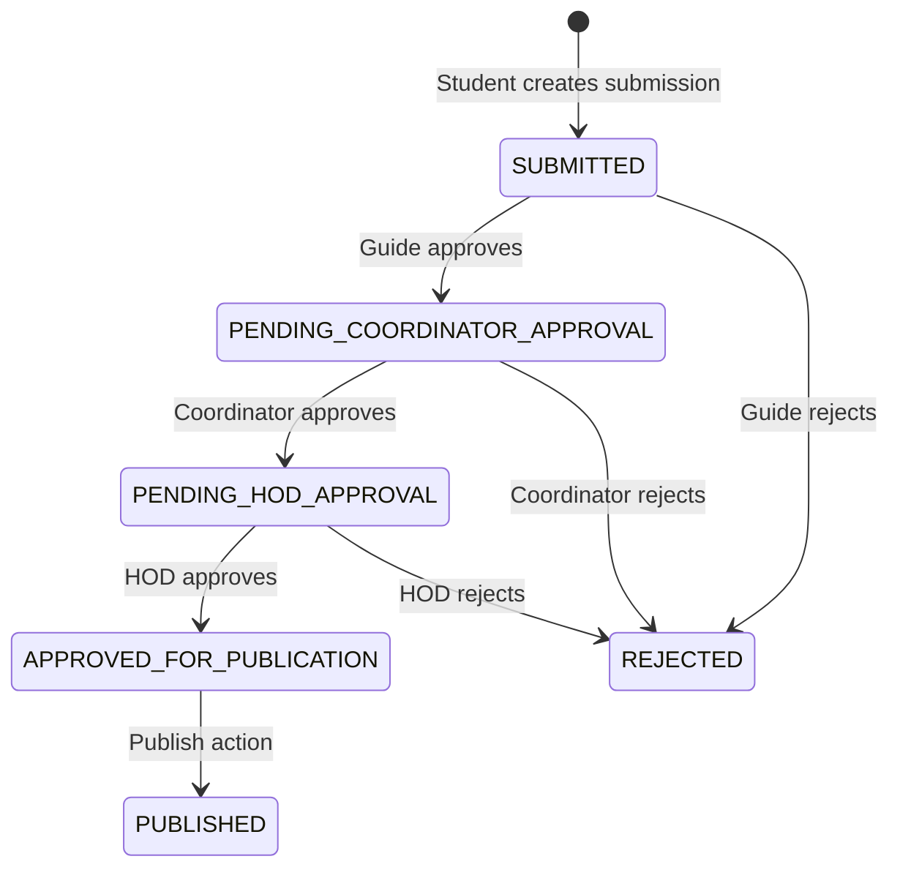
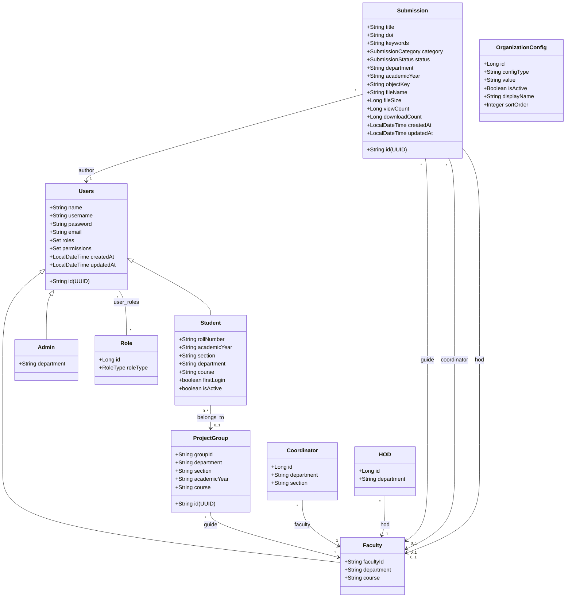
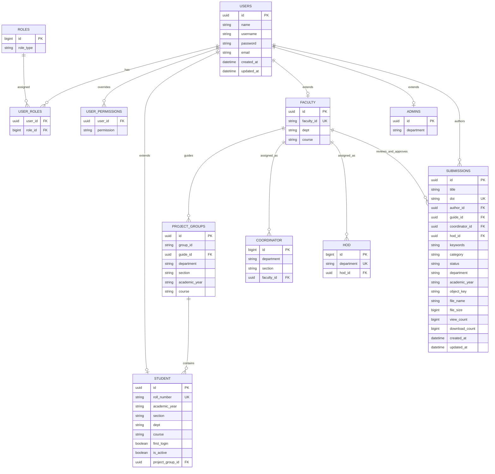
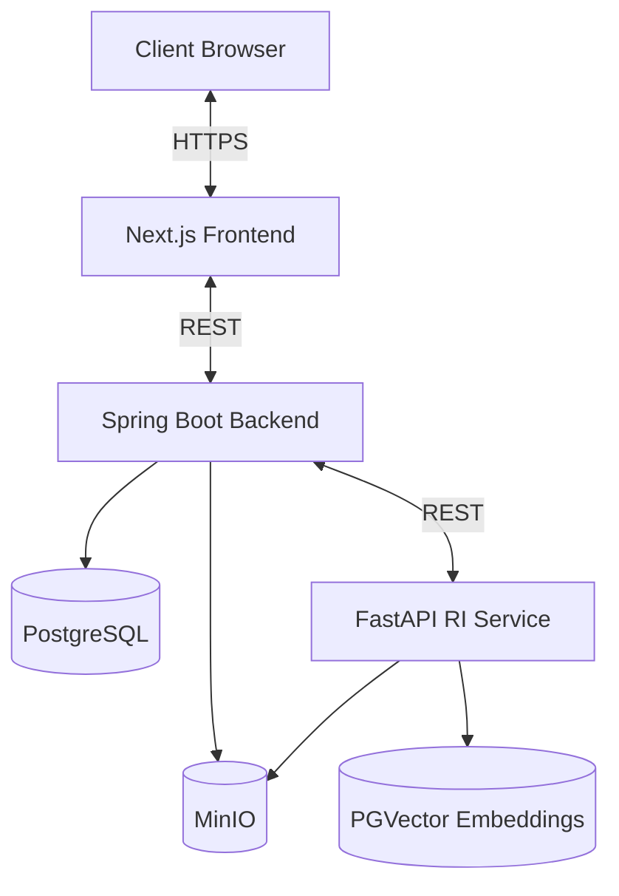

# JB Academic Publication Portal 

> **⚠️ Note:** This project is under active development. Some requirements, features, and implementation details may evolve as development progresses. Refer to the latest version of this document for the most current information.

---
## Table of Contents

- [Overview](#overview)
- [Repository Structure](#repository-structure)
- [Technology Stack](#technology-stack)
- [Implemented Roles and Permissions](#implemented-roles-and-permissions)
- [Implemented Workflow](#implemented-workflow)
- [Core Domain Model (Implemented)](#core-domain-model-implemented)
- [Database Schema (Implemented)](#database-schema-implemented)
- [API Snapshot](#api-snapshot)
- [Runtime Configuration](#runtime-configuration)
- [Architecture](#architecture)
- [Current Scope and Gaps](#current-scope-and-gaps)

---

## Overview

The **JB Academic Publication Portal** is a multi-service platform for:

- Institutional user onboarding (students/faculty/admin)
- Project group and academic hierarchy mapping (Guide, Coordinator, HOD)
- Submission upload and tracking
- Multi-stage approval workflow
- Publication and discovery with semantic search + Q&A

---

## Repository Structure

- `frontend-web`: Next.js application (App Router, JavaScript)
- `server-base`: Spring Boot backend (Java + Kotlin), auth, workflow, storage integration
- `research-intelligence-service`: FastAPI RAG service (document processing, semantic retrieval, Q&A)

---

## Technology Stack

| Layer | Technology |
|---|---|
| Frontend | Next.js 16 + React 19 (JavaScript) |
| Backend API | Spring Boot 4.0.3 (Java 21), Kotlin (Exposed table bootstrap) |
| Auth/Security | `security-starter` + JWT |
| DB | PostgreSQL |
| Object Storage | MinIO |
| AI Service | FastAPI + LangChain PGVector + sentence-transformers + Groq LLM |

---

## Implemented Roles and Permissions

### Role Enum (`RoleType`)

- `USER`
- `STUDENT`
- `FACULTY`
- `GUIDE`
- `PROJECT_COORDINATOR`
- `HOD`
- `ADMIN`

### Effective Permission Mapping (from `SecurityConstants`)

- `STUDENT`: `submission:create`, `submission:read:own`
- `FACULTY`: `submission:read`
- `GUIDE`: `submission:read`, `submission:approve:guide`
- `PROJECT_COORDINATOR`: `submission:read`, `submission:approve:coordinator`, `submission:publish`
- `HOD`: `submission:read`, `submission:approve:hod`, `submission:publish`
- `ADMIN`: `user:manage`, `submission:read`, `submission:manage`, `group:manage`, `coordinator:manage`, `hod:manage`
- `USER`: `submission:read`

---

## Implemented Workflow

### Submission Categories (`SubmissionCategory`)

- `RESEARCH_PAPER`
- `MAJOR_PROJECT_REPORT`
- `MINI_PROJECT_REPORT`
- `INTERNSHIP_REPORT`

### Submission Status (`SubmissionStatus`)

- `DRAFT`
- `SUBMITTED`
- `PENDING_GUIDE_APPROVAL`
- `PENDING_COORDINATOR_APPROVAL`
- `PENDING_HOD_APPROVAL`
- `APPROVED_FOR_PUBLICATION`
- `REJECTED`
- `PUBLISHED`

### Current Approval Flow (as implemented in services)

Notes:

- New submissions are currently created with `SUBMITTED` status.
- `DRAFT` and `PENDING_GUIDE_APPROVAL` are present in enum and query logic but not set by current create flow.

---

## Core Domain Model (Implemented)

### JPA Entity Model

---

## Database Schema (Implemented)

The backend currently uses:

1. **JPA/Hibernate tables** for application domain entities
2. **Exposed-managed tables** for review/publication support tables
3. **RI service PGVector tables** for semantic indexing

### 1) JPA/Hibernate Tables

| Table | Purpose |
|---|---|
| `users` | Base user account entity |
| `student` | Student-specific fields (joined inheritance, FK to `users.id`) |
| `faculty` | Faculty-specific fields (joined inheritance, FK to `users.id`) |
| `admins` | Admin-specific fields (joined inheritance, FK to `users.id`) |
| `roles` | Role master (`RoleType`) |
| `user_roles` | Many-to-many relation between users and roles |
| `user_permissions` | Explicit per-user permissions |
| `project_groups` | Group metadata + assigned guide |
| `coordinator` | Department+section coordinator mapping to faculty |
| `hod` | Department to HOD mapping |
| `organization_config` | Configured DEPARTMENT/COURSE/SECTION values |
| `submissions` | Submission records, workflow status, storage metadata, counters |

### 2) Exposed-Managed Tables (`server-base/src/main/kotlin/.../Tables.kt`)

| Table | Key columns |
|---|---|
| `documents` | `submission_id`, file metadata, `version_number` |
| `supplementary_files` | `submission_id`, file/url metadata |
| `review_assignments` | `submission_id`, `reviewer_id`, status/timestamps |
| `reviews` | `assignment_id`, comments, score, decision |
| `editorial_decisions` | `submission_id`, `admin_id`, final decision |
| `publications` | publication metadata derived from submissions |
| `publication_metrics` | view/download counters per publication |

### 3) RI Service Semantic Store

| Table | Purpose |
|---|---|
| `langchain_pg_embedding` | Chunk embeddings + metadata JSON (`submission_id`, title, author, category, etc.) |

The RI service ensures PostgreSQL `vector` extension exists during startup.

### ER Diagram (Practical View)

---

## API Snapshot

### Registration and Auth

- `POST /register`
- `POST /register/student`
- `POST /register/faculty`
- `POST /register/admin`
- `POST /api/auth/change-first-loginPassword` (student first-login password reset)

### Admin Operations

- Student bulk seeding from Excel
- Add student/faculty
- Manage project groups
- Assign section coordinators and department HODs
- Manage organization config values (`DEPARTMENT`, `COURSE`, `SECTION`)

### Submissions

- Create submission (`multipart`: file + metadata)
- Fetch all submissions / my submissions / by id
- Filter by category
- Track view/download counts
- Download signed URL from MinIO
- Semantic search (`/api/submissions/search`)
- Q&A (`/api/submissions/ask`)

### Review

- Queue endpoints: guide/coordinator/hod
- Approval endpoints per stage
- Reject endpoints per stage
- Publish endpoint
- Query by status

---

## Runtime Configuration

Key backend environment values:

- `DB_URL`, `DB_USERNAME`, `DB_PASSWORD`
- `MINIO_URL`, `MINIO_ACCESS_KEY`, `MINIO_SECRET_KEY`, `MINIO_BUCKET`
- `RI_SERVICE_URL`
- `JWT_SECRET`
- Optional multipart limits: `MAX_FILE_SIZE`, `MAX_REQUEST_SIZE`

Backend default port: `8080`.
Frontend default port: `3000`.
RI service default port: `8000`.

---

## Architecture

---

## Current Scope and Gaps

Implemented now:

- Role-based authentication and user registration flows
- Project-group and faculty hierarchy mapping
- Submission upload + DOI generation + MinIO persistence
- Multi-stage approval chain (Guide -> Coordinator -> HOD -> Publish)
- Semantic search and RAG Q&A integration

Not yet fully implemented in code paths:

- Author revision loop with versioned submission history in workflow
- Full JPA-based review/comment entity persistence (review tables currently provisioned via Exposed)
- Embargo/scheduling/compliance metadata pipeline

---
